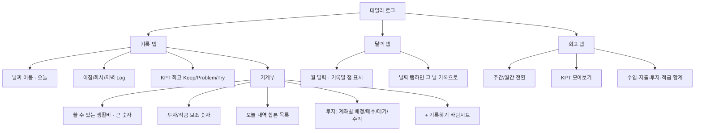
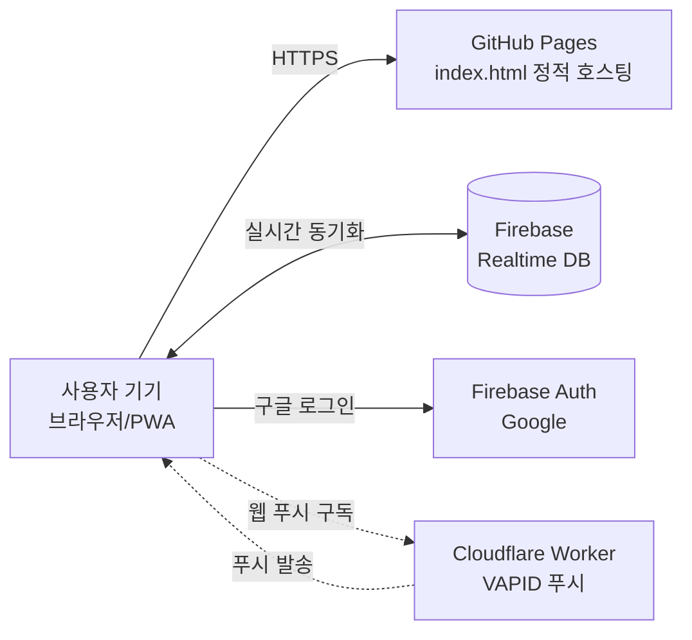
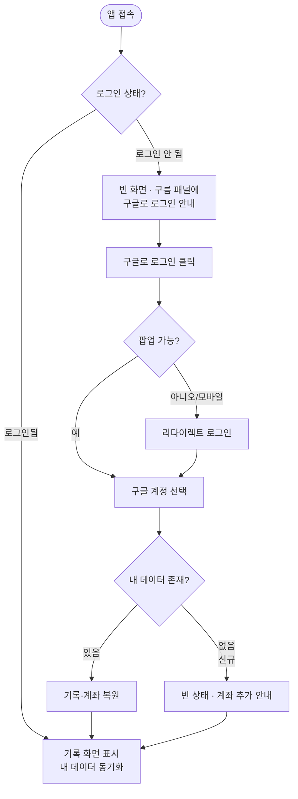
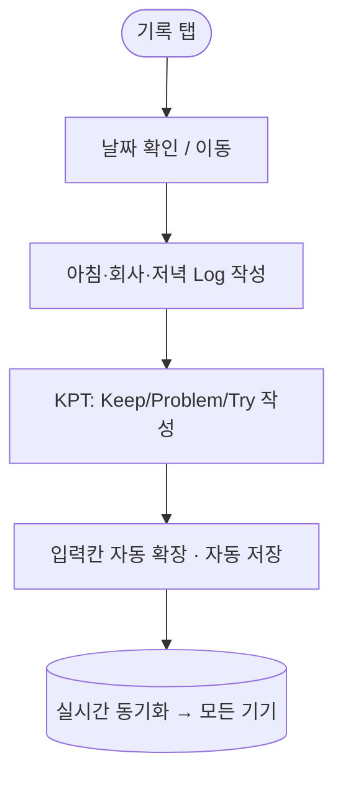
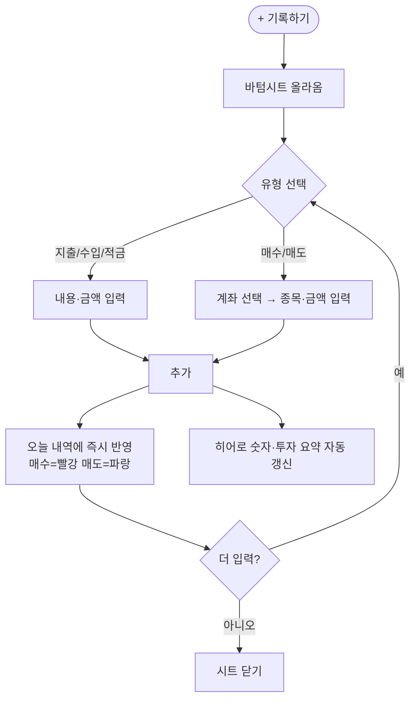
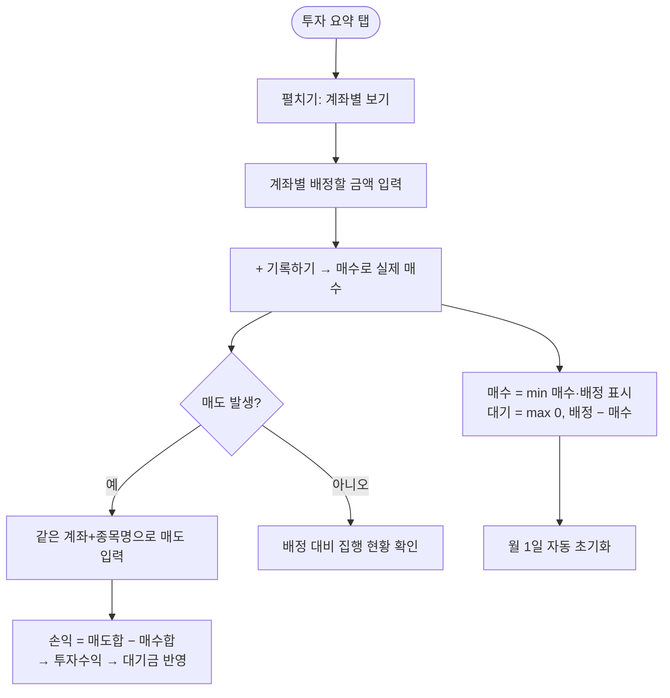
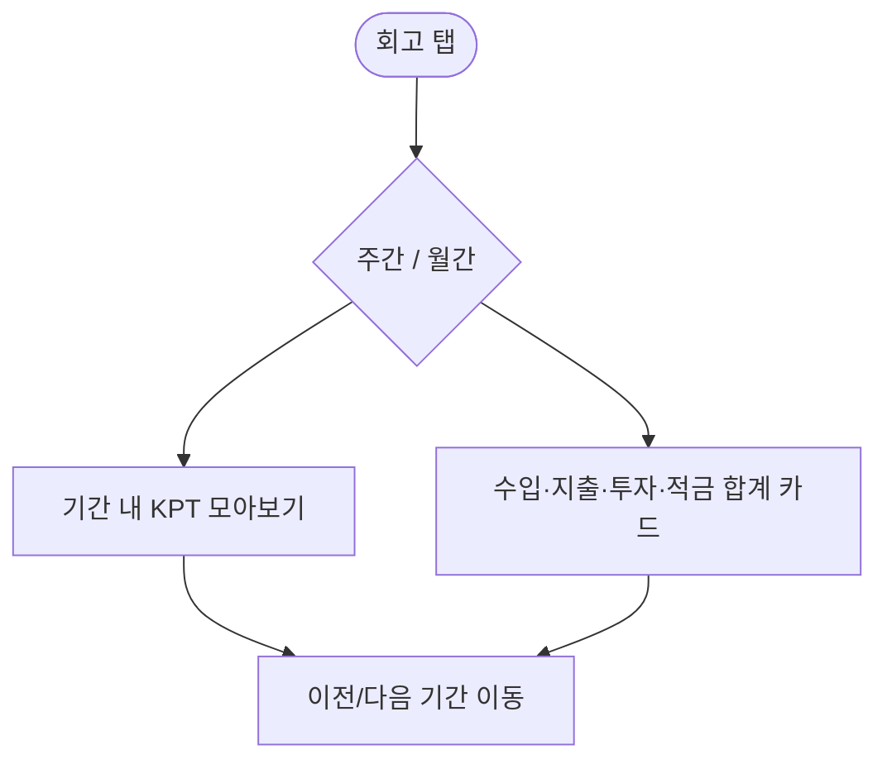
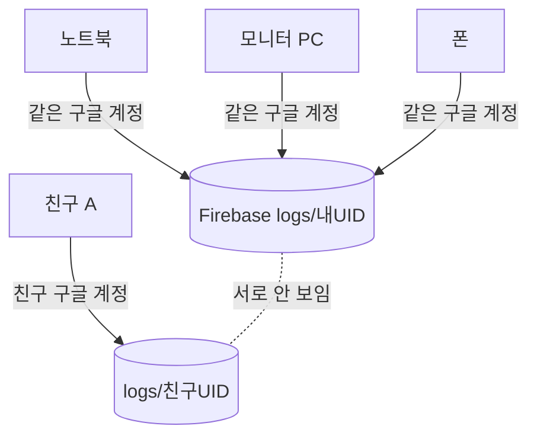

# 데일리 로그 (Daily Log) — PRD & 유저플로우

| 항목 | 내용 |
|---|---|
| 문서 버전 | v1.0 |
| 작성일 | 2026-06-25 |
| 제품명 | 데일리 로그 (Daily Log) |
| 서비스 URL | https://lnk111.github.io/daily-log/ |
| 제작 | 남경 (비개발자, AI 협업으로 직접 제작) |
| 형태 | 설치형 웹앱(PWA) · 단일 HTML 파일 |

---

## 1. 개요 (Overview)

데일리 로그는 **하루 기록 · KPT 회고 · 개인 가계부(투자/적금 포함)**를 한 화면에서 관리하는 개인용 웹앱이다. 일기 앱과 가계부 앱, 투자 메모를 따로 쓰던 것을 하나로 합쳐, "오늘 무엇을 했고, 무엇을 느꼈고, 돈을 어떻게 썼고, 투자를 얼마나 집행했는지"를 한 흐름으로 남긴다.

핵심 차별점은 **투자 자금 관리**다. 일반 가계부는 "썼다/벌었다"만 기록하지만, 데일리 로그는 매달 투자에 **배정한 목표 금액**과 **실제 매수**, **남은 대기금**, **매도 손익**을 계좌별로 추적한다. "이번 달 투자하려던 돈을 실제로 집행했는가"를 한눈에 보여주는 것이 제품의 정체성이다.

비개발자가 AI와 함께 직접 만들고 운영하는 도구로, **외주 없이 스스로 만들고 계속 고쳐 쓰는** 방식 자체가 제품의 배경이자 콘텐츠 소재다.

---

## 2. 문제 정의 & 목표

### 2.1 풀려는 문제

- **기록의 분산**: 일기, 회고, 가계부, 투자 메모가 앱마다 흩어져 있어 하루를 통합적으로 돌아보기 어렵다.
- **투자금의 모호함**: "이번 달 100만 원 투자하자"고 다짐해도 매매를 건너뛰는 달이 많고, 그 돈이 다음 달로 넘어가면 *생활비인지 안 쓴 투자금인지* 구분이 안 된다.
- **기기 분산**: 노트북 2대 + 모니터 + 폰을 오가며 쓰는데, 매번 동기화 코드를 입력하는 것이 번거롭다.

### 2.2 목표

| 구분 | 목표 |
|---|---|
| 핵심 | 하루의 행동·감정·돈을 **한 흐름으로** 기록하고 돌아본다 |
| 차별 | 투자 **배정 대비 집행**과 **계좌별 손익**을 명확히 본다 |
| 경험 | **로그인 한 번**으로 모든 기기에서 끊김 없이 이어 쓴다 |
| 확장 | 친구 몇 명이 **각자 독립적으로** 같은 앱을 쓸 수 있다 |

### 2.3 성공 기준 (정성)

- 매일 자연스럽게 한 줄이라도 남기게 된다.
- "지금 진짜 쓸 수 있는 돈"이 한눈에 정확히 보인다.
- 새 기기에서 로그인만 하면 즉시 내 기록이 나타난다.

---

## 3. 타깃 사용자

### 3.1 1차 사용자 (제작자 본인)

- 30대 여성, 인테리어 디자인 사업 운영, **장기 투자(S&P500·복리)에 관심**이 많은 적극적 투자자.
- 여러 증권·연금 계좌(키움증권 · 한국투자 ISA · 연금저축 · CMA 등)를 운용.
- 직접·간결한 정보 표현을 선호하며, 도구를 스스로 만들어 쓰는 성향.

### 3.2 2차 사용자 (친구 그룹)

- 같은 앱을 각자 구글 계정으로 로그인해 **독립적으로** 사용.
- 서로의 기록은 보이지 않으며 데이터가 섞이지 않는다.
- 투자 계좌 구성은 사람마다 달라, **계좌를 직접 추가**해 시작한다.

---

## 4. 정보 구조 (3-탭)



---

## 5. 기능 요구사항 (Features)

우선순위: **P0** = 핵심(필수) · **P1** = 중요 · **P2** = 부가

### 5.1 일일 기록 (기록 탭)

| ID | 기능 | 설명 | 우선 |
|---|---|---|---|
| R-1 | 날짜 네비게이션 | ◀ / ▶ 로 날짜 이동, "오늘" 버튼으로 복귀 | P0 |
| R-2 | 아침/회사/저녁 Log | 줄 노트 형태의 자동 확장 입력칸 3개 | P0 |
| R-3 | KPT 회고 | Keep(초록)/Problem(빨강)/Try(파랑) 입력. 색 라벨 | P0 |
| R-4 | 자동 높이 확장 | 3줄·100줄 무엇을 쓰든 **미리보기 없이 전체 표시** (탭 전환·로드·동기화·창 크기 변경 시 모두 재계산) | P0 |
| R-5 | 자동 저장 | 입력 시 디바운스(0.6초) 저장 · "저장 중" 표시 | P0 |

### 5.2 가계부 (기록 탭 내)

| ID | 기능 | 설명 | 우선 |
|---|---|---|---|
| F-1 | 쓸 수 있는 생활비(히어로) | 상단 큰 숫자. **= 누적 수입 − 누적 지출 − 누적 적금 − 이번 달 투자 배정 합계** | P0 |
| F-2 | 투자/적금 보조 숫자 | 히어로 아래 작게 표기(투자 매수/배정, 적금 누적) | P0 |
| F-3 | 오늘 내역(합본) | 수입·지출·매수·매도·적금을 한 목록에. **매수=빨강, 매도=파랑, 수입=초록**, 각 항목 삭제 가능 | P0 |
| F-4 | 입력 바텀시트 | "+ 기록하기" → 하단에서 입력 시트 슬라이드 업. 유형 선택 **[지출·수입] · [매수·매도] · [적금]** 박스 그룹 | P0 |
| F-5 | 계좌 선택 노출 | **매수·매도일 때만** 계좌 드롭다운 표시(지출/수입/적금엔 미표시) | P0 |
| F-6 | 계좌별 투자 관리 | "투자" 요약 탭 → 펼치면 계좌별 **배정/매수/대기**. 계좌 추가·삭제 | P0 |
| F-7 | 대기금 0 바닥 | 대기 = `max(0, 배정 − 매수)`. **음수 불가** (예수금 사용, 미수금 미사용 전제) | P0 |
| F-8 | 매수 표시 캡 | 요약의 매수 표시는 배정을 넘지 않음 = `Σ min(계좌 매수, 계좌 배정)` (거래 내역의 실제 금액은 그대로 보존) | P0 |
| F-9 | 매도 손익 엔진 | **(계좌 + 종목명) 정확 일치** 기준 `매도합 − 매수합`을 투자수익으로 계산 → 대기금에 반영. 이익=초록, 손실=빨강 | P0 |
| F-10 | 월 단위 초기화 | 매월 1일 투자 배정·대기·적금·투자수익 0원에서 다시 시작 | P0 |
| F-11 | 계좌 빈 상태 안내 | 등록 계좌가 없으면 4계좌 기본 노출 대신 **사용법 가이드(1·2·3 단계 + 예시)** 표시 | P1 |
| F-12 | 계좌 자동 복원 | 로그인 시 저장된 계좌가 없으면 기존 매수·배정 기록에서 계좌 목록을 **복원**하고 1회 저장 | P1 |

### 5.3 달력 (달력 탭)

| ID | 기능 | 설명 | 우선 |
|---|---|---|---|
| C-1 | 월 그리드 | 한 달 달력, 기록 있는 날 점 표시 | P0 |
| C-2 | 날짜 진입 | 날짜 탭 → 그 날 기록 탭으로 이동 | P0 |
| C-3 | 월 통계 | "이 달에 N일 기록" 표기 | P1 |

### 5.4 회고 (회고 탭)

| ID | 기능 | 설명 | 우선 |
|---|---|---|---|
| V-1 | 주간/월간 전환 | 기간 토글 + 이전/다음 기간 이동 | P0 |
| V-2 | KPT 모아보기 | 기간 내 Keep/Problem/Try를 날짜별로 집계 | P0 |
| V-3 | 가계부 요약 | 수입 · 지출 · 투자 매수 · 적금 합계 카드 | P0 |

### 5.5 로그인 & 동기화

| ID | 기능 | 설명 | 우선 |
|---|---|---|---|
| A-1 | 구글 로그인 | 구름 패널에서 "구글로 로그인" 한 번. 코드/설정 입력 불필요(설정은 앱에 내장) | P0 |
| A-2 | 멀티 기기 동기화 | 같은 구글 계정으로 로그인 시 모든 기기 실시간 동기화 | P0 |
| A-3 | 사용자 격리 | 데이터는 `logs/{uid}`에 저장 · 각자 자기 기록만 접근(보안 규칙 `auth.uid == $uid`) | P0 |
| A-4 | 프로필 표시 | 헤더 우측에 이메일 첫 글자/프로필 원형 · 탭하면 로그아웃 패널 | P1 |
| A-5 | 로그아웃 시 비움 | 로그아웃되면 이 기기의 화면·복사본(생활비·투자·적금·배정·내역)을 즉시 비움. **클라우드 기록은 보존**, 재로그인 시 복원 | P0 |
| A-6 | 모바일 대응 | 팝업 차단 시 리다이렉트 로그인으로 자동 전환 | P1 |

### 5.6 알림 (P1)

| ID | 기능 | 설명 |
|---|---|---|
| N-1 | 인앱 리마인더 | "오늘 아직 기록 전이에요" 배너 |
| N-2 | 웹 푸시 | 앱을 닫아도 알림(서비스워커 + Cloudflare Worker + VAPID). iOS는 홈 화면 설치 시 |

---

## 6. 비기능 요구사항

| 영역 | 요구사항 |
|---|---|
| 호환성 | 데스크톱/모바일 브라우저, PWA 설치, 오프라인 캐시 |
| 성능 | 단일 HTML, 외부 의존 최소(파이어베이스 CDN) · 즉시 로딩 |
| 데이터 안전 | 클라우드(파이어베이스)가 원본, 로컬은 캐시. 마이그레이션은 항상 **복사(비파괴)** |
| 입력 UX | 추가 버튼이 포커스를 빼앗지 않게 처리 → 한글 입력기(IME) 유지(연속 입력) |
| 보안 | 사용자별 읽기/쓰기 규칙. 친구 간 데이터 비공개 |
| 비용 | 무료 요금제(Firebase Spark)로 소규모(약 5명) 충분 |

---

## 7. 데이터 모델

저장 위치: Firebase Realtime Database, 경로 `logs/{uid}`

```
logs/{uid}
├── 2026-06-19              # 날짜별 기록 (key: YYYY-MM-DD)
│   ├── morning / work / evening   # 아침·회사·저녁 Log (텍스트)
│   ├── keep / problem / try        # KPT
│   └── fin                         # 가계부
│       ├── inc[]   { label, amount }            # 수입
│       ├── exp[]   { label, amount }            # 지출
│       ├── buy[]   { label, amount, acct }      # 매수
│       ├── sell[]  { label, amount, acct }      # 매도
│       └── sav[]   { label, amount }            # 적금
├── _alloc                  # 월별·계좌별 배정 { "2026-06": { "키움증권": 4400000, ... } }
└── _accts                  # 계좌 목록 ["키움증권", "한국투자 ISA", ...]
```

로컬(브라우저)에는 같은 내용을 캐시로 보관하며, 로그아웃 시 비운다.

---

## 8. 핵심 계산 규칙 (가계부 로직)

| 값 | 공식 |
|---|---|
| 쓸 수 있는 생활비(오늘) | `누적(수입 − 지출) − 누적 적금 − 이번 달 투자 배정 합계` |
| 계좌 대기 | `max(0, 배정 − 그 달 매수합)` (음수 불가) |
| 요약 매수(표시) | `Σ min(계좌 매수합, 계좌 배정)` (배정 초과 표시 안 함) |
| 투자수익(손익) | `(계좌+종목명) 일치 종목별 (매도합 − 매수합)의 합` |
| 투자 대기금(총) | `max(0, Σ계좌대기 + 투자수익)` |
| 초기화 | 매월 1일 배정·대기·적금·투자수익 리셋 |

> **주의(현재 한계)**: 손익은 같은 달 안에서 매수·매도가 짝지어질 때 정확하다. 지난달 산 종목을 이번 달 팔면 매입가가 0으로 잡혀 수익이 과대 계산될 수 있다(월 단위 초기화의 부작용). 정확도가 필요하면 "전체 기간 기준(누적)" 손익으로 전환 가능. 또한 손익은 **계좌 + 종목명이 정확히 같아야** 매칭된다.

---

## 9. 기술 스택 / 아키텍처



- **프론트**: 단일 `index.html`, 바닐라 JS(프레임워크 없음), 따뜻한 크림 팔레트.
- **백엔드(서버리스)**: Firebase Realtime DB + Auth(Google).
- **호스팅**: GitHub Pages (`lnk111/daily-log`).
- **푸시(선택)**: Service Worker + Cloudflare Worker(VAPID).
- **보안 규칙**:
```json
{ "rules": { "logs": { "$uid": {
  ".read": "auth != null && auth.uid == $uid",
  ".write": "auth != null && auth.uid == $uid" } } } }
```

---

## 10. 디자인 원칙 (토스 스타일)

1. **핵심 숫자를 주인공으로** — "오늘 쓸 수 있는 돈"을 가장 크게.
2. **선 대신 여백** — 테두리·구분선을 줄이고 간격으로 구역을 나눔.
3. **입력은 바텀시트로** — 평소 화면은 숫자·내역만, 입력은 "+ 기록하기" 시트로.
4. **복잡한 건 접어두기** — 투자 계좌 상세는 "투자" 요약을 탭해 펼침.
5. **의미 있는 색만** — 매수=빨강, 매도=파랑, 수입=초록, 그 외 무채색.

> 색 팔레트는 토스 블루가 아닌, 제품 고유의 **따뜻한 크림 톤**을 유지한다.

---

## 11. 유저 플로우 (User Flows)

### 11.1 첫 진입 & 로그인 (온보딩)



### 11.2 하루 기록 작성



### 11.3 가계부 — 수입/지출/매수/매도/적금 기록



### 11.4 투자 관리 — 배정 → 매수 → 손익



### 11.5 회고 보기



### 11.6 멀티 기기 / 친구 사용



---

## 12. 향후 로드맵 (Backlog)

| 단계 | 항목 | 메모 |
|---|---|---|
| 단기 | 손익 "전체 기간 기준" 옵션 | 월 경계 넘는 매도의 매입가 정확화 |
| 단기 | 계좌 순서 정렬/이름 변경 | 복원된 계좌 순서 커스터마이즈 |
| 중기 | 투자 월별 추이 그래프 | 배정 대비 집행 트렌드 |
| 중기 | 회고 통계 강화 | KPT 키워드, 기록 빈도 |
| 장기 | 그룹/관리자 뷰 | 친구 그룹용 (현재는 각자 독립) |
| 장기 | 데이터 내보내기 | CSV/백업 |

---

## 13. 부록 — 용어

| 용어 | 뜻 |
|---|---|
| 배정 | 그 달 그 계좌에 투자하기로 정한 목표 금액 |
| 매수 | 실제로 산 금액(요약은 배정까지만 표시) |
| 대기(대기금) | 배정 중 아직 안 산 금액 (`배정 − 매수`, 0 바닥) |
| 투자수익 | (계좌+종목명) 일치 종목의 `매도합 − 매수합` |
| 쓸 수 있는 생활비 | 수입−지출에서 적금·투자 배정을 뺀 실제 가용 현금 |
| KPT | Keep(잘한 것)/Problem(문제)/Try(시도할 것) 회고 |

---

*이 문서는 데일리 로그의 현재 구현 상태를 기준으로 작성되었으며, 제품이 발전함에 따라 갱신된다.*
